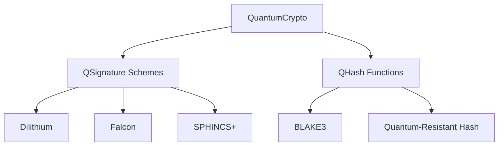
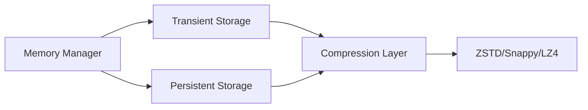
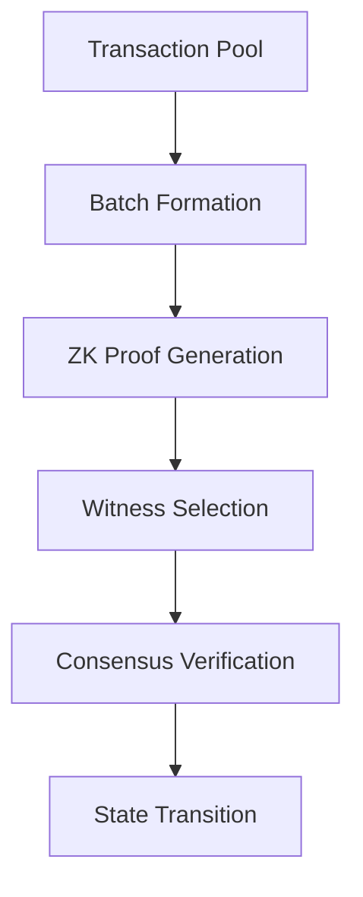
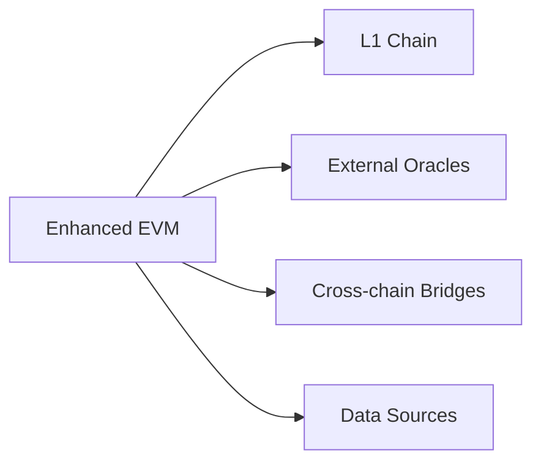
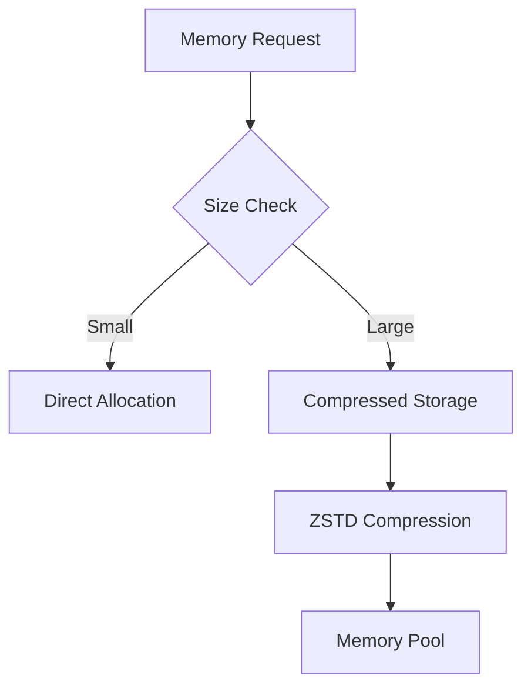

# Enhanced Quantum-Safe EVM Architecture

## Table of Contents
1. [Overview](#overview)
2. [Core Components](#core-components)
3. [Feature Comparison](#feature-comparison)
4. [Consensus Mechanism](#consensus-mechanism)
5. [Security Features](#security-features)
6. [Integration Points](#integration-points)
7. [Performance Optimizations](#performance-optimizations)

## Overview

Our enhanced EVM implementation extends the original Ethereum Virtual Machine with quantum-safe features, advanced consensus mechanisms, and optimized performance characteristics. The architecture is designed to be modular, secure, and future-proof.

## Core Components

### 1. Quantum-Safe Cryptography Layer


### 2. Enhanced Memory Management


### 3. Proof of Batch Probabilistic Consensus (POBPC)


## Feature Comparison

| Feature | Original EVM | Enhanced EVM |
|---------|-------------|--------------|
| **Cryptography** | ECDSA, Keccak-256 | Quantum-safe signatures (Dilithium, Falcon), BLAKE3 |
| **Memory Model** | Single-layer storage | Dual-layer (Transient + Persistent) with compression |
| **Consensus** | PoW/PoS | POBPC with quantum-safe proofs |
| **State Management** | Merkle Patricia Trie | Enhanced Merkle Trie with quantum resistance |
| **External Links** | Basic precompiles | Secure quantum-safe external oracle system |
| **Performance** | ~15-30 TPS | ~3M TPS with batch processing |
| **Security Level** | Classical | Post-quantum |
| **Smart Contracts** | Solidity | Extended Solidity with quantum-safe primitives |
| **Gas Model** | Fixed costs | Dynamic costs based on quantum operations |
| **Cross-chain** | Limited bridges | Native quantum-safe bridges |

## Consensus Mechanism (POBPC)

### Configuration Parameters
```json
{
  "batch": {
    "maxTransactions": 100,
    "interval": "1s",
    "witnessCount": 7,
    "consensusThreshold": 0.67
  },
  "witness": {
    "minReliability": 0.5,
    "learningRate": 0.1,
    "updateInterval": "1m"
  },
  "proof": {
    "algorithm": "quantum-zk",
    "verificationTime": "100ms",
    "maxBatchSize": "1MB"
  }
}
```

### Batch Processing Flow
1. **Transaction Collection**
   - Maximum batch size: 100 transactions
   - Collection interval: 1 second
   - Dynamic sizing based on network load

2. **Proof Generation**
   - Quantum-safe ZK proof generation
   - Batch commitment using BLAKE3
   - Proof verification by witnesses

3. **Witness Selection**
   - Random selection with reliability weighting
   - Minimum 7 witnesses per batch
   - Reliability score updates using EMA

4. **Consensus Achievement**
   - 67% threshold for consensus
   - Weighted voting based on witness reliability
   - Double-signing prevention

## Security Features

### 1. Quantum Resistance
- Post-quantum cryptographic primitives
- Quantum-safe key generation
- Resistant to Shor's and Grover's algorithms

### 2. External Link Security
```json
{
  "linkSecurity": {
    "minConfirmations": 12,
    "maxResponseTime": "2s",
    "proofRequirement": true,
    "trustedSources": ["verified_oracles"],
    "verificationKey": "quantum_resistant_key"
  }
}
```

### 3. Memory Safety
- Transient storage isolation
- Atomic batch operations
- Compression with integrity checks

## Integration Points

### 1. External Systems


### 2. Smart Contract Integration
```solidity
interface IQuantumSafe {
    function qVerify(bytes memory message, bytes memory signature) external returns (bool);
    function qSign(bytes memory message) external returns (bytes memory);
    function qHash(bytes memory data) external pure returns (bytes32);
}
```

## Performance Optimizations

### 1. Batch Processing
- Dynamic batch sizing
- Parallel proof generation
- Optimized witness selection

### 2. Memory Management


### 3. Network Optimization
- Efficient proof propagation
- Witness coordination
- State sync optimization

## Future Enhancements
1. Advanced quantum resistance schemes
2. Dynamic witness selection algorithms
3. Enhanced cross-chain capabilities
4. Improved compression algorithms
5. Smart contract language extensions 