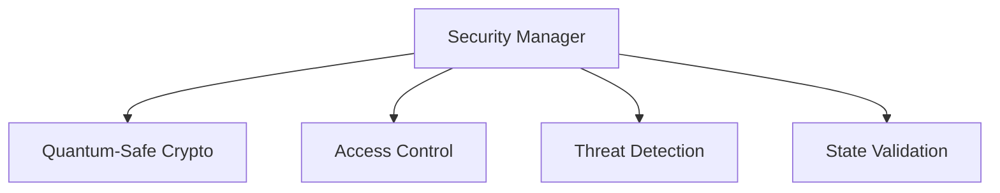
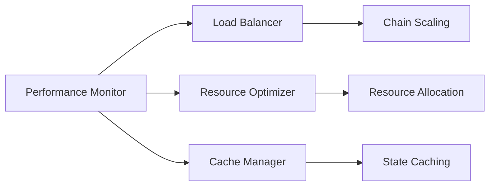

# QUIDS Technical Specification

## Table of Contents
1. [Core AI Block Architecture](#core-ai-block-architecture)
2. [Reinforcement Learning System](#reinforcement-learning-system)
3. [Chain Management](#chain-management)
4. [Consensus Mechanisms](#consensus-mechanisms)
5. [Network Layer](#network-layer)
6. [Security Architecture](#security-architecture)

## Core AI Block Architecture

### Block Structure


### Core Components Pseudo Code

#### AI Block
```cpp
class AIBlock {
private:
    TransactionPool txPool;
    StateManager stateManager;
    ConsensusModule consensus;
    RLAgent agent;
    
    struct BlockMetrics {
        double throughput;
        double latency;
        double energyUsage;
        int validatorCount;
        double securityScore;
    };

public:
    // Main block processing loop
    void processBlock() {
        // 1. Collect network metrics
        BlockMetrics metrics = collectMetrics();
        
        // 2. Get RL agent decision
        Action action = agent.decideAction(metrics);
        
        // 3. Apply optimizations
        applyOptimizations(action);
        
        // 4. Process transactions
        vector<Transaction> batch = txPool.getBatch();
        
        // 5. Execute state transitions
        for (auto& tx : batch) {
            if (validateTransaction(tx)) {
                stateManager.applyTransaction(tx);
            }
        }
        
        // 6. Consensus round
        consensus.runConsensus();
        
        // 7. Finalize block
        finalizeBlock();
    }

    // Dynamic chain spawning logic
    bool shouldSpawnChildChain() {
        return (
            txPool.getLoad() > THRESHOLD_LOAD &&
            metrics.throughput < TARGET_THROUGHPUT &&
            resources.available()
        );
    }
};
```

## Reinforcement Learning System

### RL Architecture


### State Space Definition
```cpp
struct State {
    // Network metrics
    double txThroughput;      // transactions per second
    double blockLatency;      // milliseconds
    double networkLoad;       // percentage
    
    // Resource metrics
    double cpuUsage;         // percentage
    double memoryUsage;      // percentage
    double bandwidthUsage;   // Mbps
    
    // Security metrics
    double validatorUptime;  // percentage
    int activeValidators;    // count
    double faultTolerance;   // percentage
    
    // Chain metrics
    int childChainCount;     // number of child chains
    double interchainTps;    // cross-chain transactions per second
};
```

### Action Space Implementation
```cpp
class ActionSpace {
public:
    enum ActionType {
        ADJUST_BLOCK_SIZE,
        CHANGE_CONSENSUS,
        SPAWN_CHILD_CHAIN,
        ADJUST_VALIDATOR_SET,
        MODIFY_TX_BATCH_SIZE
    };

    struct Action {
        ActionType type;
        vector<double> parameters;
    };

    // Action execution
    void executeAction(const Action& action) {
        switch (action.type) {
            case ADJUST_BLOCK_SIZE:
                adjustBlockSize(action.parameters[0]);
                break;
            case CHANGE_CONSENSUS:
                switchConsensus(static_cast<ConsensusType>(action.parameters[0]));
                break;
            // ... other actions
        }
    }
};
```

### Reward Function
```cpp
class RewardFunction {
private:
    // Weights for different metrics
    const double W_THROUGHPUT = 0.3;
    const double W_LATENCY = 0.25;
    const double W_ENERGY = 0.2;
    const double W_SECURITY = 0.25;

public:
    double calculateReward(const State& state, const Action& action) {
        double reward = 0.0;
        
        // Throughput reward
        reward += W_THROUGHPUT * calculateThroughputReward(state.txThroughput);
        
        // Latency reward (negative reward for high latency)
        reward += W_LATENCY * (1.0 / (1.0 + state.blockLatency));
        
        // Energy efficiency reward
        reward += W_ENERGY * calculateEnergyReward(state.cpuUsage, state.memoryUsage);
        
        // Security reward
        reward += W_SECURITY * calculateSecurityReward(state.validatorUptime, state.faultTolerance);
        
        return reward;
    }
};
```

## Chain Management

### Chain Hierarchy


### Chain Creation Process
```cpp
class ChainFactory {
private:
    struct ChainConfig {
        ConsensusType consensusType;
        int validatorCount;
        double blockSize;
        int txBatchSize;
    };

public:
    Chain* createChildChain(const State& parentState) {
        // 1. Resource validation
        if (!validateResources()) {
            return nullptr;
        }

        // 2. Generate chain configuration
        ChainConfig config = generateOptimalConfig(parentState);

        // 3. Initialize chain
        Chain* childChain = new Chain(config);

        // 4. Setup cross-chain communication
        setupCrossChainBridge(childChain);

        // 5. Initialize validator set
        initializeValidators(childChain, config.validatorCount);

        return childChain;
    }

    void setupCrossChainBridge(Chain* childChain) {
        // Bridge setup logic
        Bridge* bridge = new Bridge(parentChain, childChain);
        bridge->initializeMessageQueue();
        bridge->setupStateVerification();
    }
};
```

## Consensus Mechanisms

### Consensus Selection


### Consensus Implementation
```cpp
class ConsensusModule {
public:
    enum ConsensusType {
        PBFT,
        HOTSTUFF,
        HONEYBADGER,
        POS
    };

    void switchConsensus(ConsensusType newType) {
        // Graceful shutdown of current consensus
        currentConsensus->shutdown();
        
        // Initialize new consensus
        switch (newType) {
            case PBFT:
                currentConsensus = new PBFTConsensus();
                break;
            case HOTSTUFF:
                currentConsensus = new HotStuffConsensus();
                break;
            // ... other consensus types
        }
        
        // Start new consensus
        currentConsensus->initialize();
    }
};
```

## Network Layer

### Network Architecture


### Network Implementation
```cpp
class NetworkLayer {
private:
    P2PNetwork network;
    MessageRouter router;
    ConnectionManager connManager;

public:
    void handleMessage(const Message& msg) {
        switch (msg.type) {
            case MessageType::TRANSACTION:
                router.routeToTxPool(msg);
                break;
            case MessageType::CONSENSUS:
                router.routeToConsensus(msg);
                break;
            case MessageType::STATE_SYNC:
                router.routeToStateSync(msg);
                break;
            case MessageType::CROSS_CHAIN:
                router.routeToBridge(msg);
                break;
        }
    }

    void broadcastMessage(const Message& msg) {
        vector<NodeID> peers = connManager.getActivePeers();
        for (const auto& peer : peers) {
            network.sendMessage(peer, msg);
        }
    }
};
```

## Security Architecture

### Security Layers


### Security Implementation
```cpp
class SecurityManager {
private:
    CryptoProvider crypto;
    AccessControl access;
    ThreatDetector detector;
    StateValidator validator;

public:
    bool validateBlock(const Block& block) {
        // 1. Cryptographic validation
        if (!crypto.verifySignatures(block)) {
            return false;
        }

        // 2. State validation
        if (!validator.validateStateTransitions(block)) {
            return false;
        }

        // 3. Consensus rules
        if (!validateConsensusRules(block)) {
            return false;
        }

        // 4. Threat detection
        if (detector.detectThreats(block)) {
            return false;
        }

        return true;
    }
};
```

## Performance Optimization

### Optimization Strategies


### Implementation
```cpp
class PerformanceOptimizer {
private:
    LoadBalancer balancer;
    ResourceManager resources;
    CacheManager cache;

public:
    void optimize(const Metrics& metrics) {
        // 1. Analyze current performance
        PerformanceAnalysis analysis = analyzeMetrics(metrics);

        // 2. Optimize resource allocation
        if (analysis.needsResourceOptimization) {
            resources.rebalance();
        }

        // 3. Load balancing
        if (analysis.needsLoadBalancing) {
            balancer.redistributeLoad();
        }

        // 4. Cache optimization
        cache.optimizeStateCache(analysis);
    }
};
```

This technical specification provides a detailed overview of the QUIDS implementation. Each component is designed to work together seamlessly while maintaining modularity for easy updates and maintenance. The diagrams and pseudo code demonstrate the relationships between components and their implementation details.

For implementation, follow these key principles:
1. Modularity: Each component should be independently testable and upgradeable
2. Scalability: Design for horizontal scaling through child chains
3. Security: Implement security at every layer
4. Performance: Optimize for high throughput while maintaining security
5. Adaptability: Use RL for dynamic optimization of system parameters
``` 