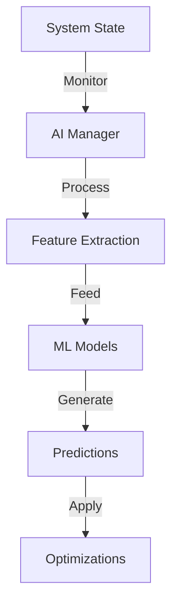

# AI Component Operations Flow

## Overview
The AI system in Quids provides intelligent optimization and decision-making across multiple blockchain components, including transaction processing, block creation, and system parameter tuning.

## Core AI Components

### 1. AI Manager


**Implementation:**
```cpp
class AIManager {
public:
    struct AIConfig {
        size_t update_interval_ms{1000};
        double learning_rate{0.001};
        size_t batch_size{32};
        double min_confidence{0.85};
    };

    void processSystemState() {
        // 1. Collect system metrics
        auto metrics = metrics_collector_->getMetrics();
        
        // 2. Extract features
        auto features = feature_extractor_->extract(metrics);
        
        // 3. Generate predictions
        auto predictions = ml_model_->predict(features);
        
        // 4. Apply optimizations
        if (predictions.confidence >= config_.min_confidence) {
            applyOptimizations(predictions.optimizations);
        }
        
        // 5. Update models
        updateModels(metrics, predictions);
    }

private:
    void applyOptimizations(const std::vector<Optimization>& optimizations) {
        for (const auto& opt : optimizations) {
            switch (opt.type) {
                case OptimizationType::BLOCK_SIZE:
                    block_manager_->updateBlockSize(opt.value);
                    break;
                case OptimizationType::GAS_LIMIT:
                    chain_manager_->updateGasLimit(opt.value);
                    break;
                case OptimizationType::TX_ORDERING:
                    tx_pool_->updateOrdering(opt.ordering_weights);
                    break;
            }
        }
    }
};
```

### 2. Feature Extraction
```cpp
class FeatureExtractor {
public:
    struct Features {
        // Network features
        double network_load;
        double peer_count;
        double bandwidth_usage;
        
        // Transaction features
        double tx_throughput;
        double avg_gas_price;
        double mempool_size;
        
        // Block features
        double block_time;
        double block_size;
        double gas_usage;
        
        // System features
        double cpu_usage;
        double memory_usage;
        double quantum_resource_usage;
    };

    Features extract(const SystemMetrics& metrics) {
        return Features{
            .network_load = calculateNetworkLoad(metrics),
            .peer_count = metrics.active_peers,
            .bandwidth_usage = metrics.bandwidth_usage,
            .tx_throughput = calculateThroughput(metrics),
            .avg_gas_price = calculateAvgGasPrice(metrics),
            .mempool_size = metrics.mempool_size,
            .block_time = metrics.avg_block_time,
            .block_size = metrics.avg_block_size,
            .gas_usage = metrics.gas_usage,
            .cpu_usage = metrics.cpu_usage,
            .memory_usage = metrics.memory_usage,
            .quantum_resource_usage = metrics.quantum_usage
        };
    }
};
```

### 3. ML Model Management
```cpp
class MLModelManager {
public:
    struct ModelConfig {
        size_t input_size{12};  // Number of features
        size_t hidden_size{128};
        size_t num_layers{3};
        double dropout_rate{0.2};
    };

    struct Prediction {
        std::vector<Optimization> optimizations;
        double confidence;
        std::vector<double> feature_importance;
    };

    Prediction predict(const Features& features) {
        // 1. Preprocess features
        auto processed = preprocessFeatures(features);
        
        // 2. Run through model
        auto output = model_->forward(processed);
        
        // 3. Post-process predictions
        return postprocessPredictions(output);
    }

    void updateModel(const TrainingData& data) {
        // 1. Prepare training batch
        auto batch = prepareBatch(data);
        
        // 2. Train model
        model_->train(batch);
        
        // 3. Update metrics
        updateTrainingMetrics(batch);
    }
};
```

### 4. Optimization Engine
```cpp
class OptimizationEngine {
public:
    struct OptimizationResult {
        std::vector<Parameter> updated_params;
        double expected_improvement;
        double confidence_score;
    };

    OptimizationResult optimize(const SystemState& state) {
        // 1. Analyze current state
        auto analysis = analyzeState(state);
        
        // 2. Generate optimization candidates
        auto candidates = generateCandidates(analysis);
        
        // 3. Evaluate candidates
        auto evaluation = evaluateCandidates(candidates);
        
        // 4. Select best optimization
        return selectBestOptimization(evaluation);
    }

private:
    std::vector<Parameter> generateCandidates(const StateAnalysis& analysis) {
        std::vector<Parameter> candidates;
        
        // Generate parameter variations
        for (const auto& param : analysis.tunable_params) {
            auto variations = parameterSearch_->generateVariations(param);
            candidates.insert(
                candidates.end(),
                variations.begin(),
                variations.end()
            );
        }
        
        return candidates;
    }
};
```

## AI Metrics and Monitoring

```cpp
struct AIMetrics {
    // Model performance
    double prediction_accuracy{0.0};
    double training_loss{0.0};
    double validation_loss{0.0};
    
    // Optimization metrics
    double optimization_success_rate{0.0};
    double avg_improvement{0.0};
    double resource_efficiency{0.0};
    
    // System impact
    double throughput_improvement{0.0};
    double latency_reduction{0.0};
    double resource_utilization{0.0};
    
    // Learning metrics
    size_t training_iterations{0};
    size_t model_updates{0};
    double learning_rate{0.0};
    
    // Resource usage
    double cpu_usage{0.0};
    double memory_usage{0.0};
    double gpu_usage{0.0};
};
```

This document details the AI component operations in the Quids blockchain, covering the AI manager, feature extraction, ML model management, and optimization engine. 