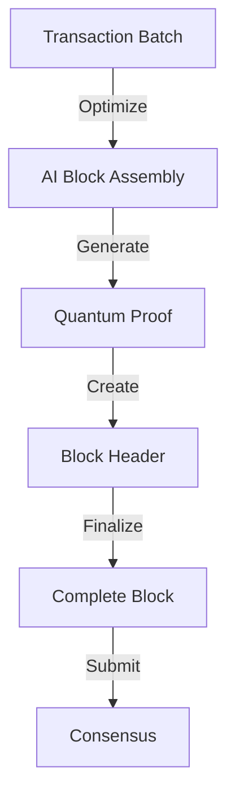

# Block Processing Flow

## Overview
The block processing system handles the creation, validation, and finalization of blocks, incorporating AI optimization, quantum proofs, and state management.

## Block Lifecycle

### 1. Block Creation


**Implementation:**
```cpp
class BlockCreator {
public:
    struct BlockConfig {
        size_t max_transactions{1000};
        size_t target_size_bytes{1024 * 1024}; // 1MB
        uint64_t min_gas_limit{5000000};
        uint64_t max_gas_limit{30000000};
    };

    Block createBlock(const std::vector<Transaction>& transactions) {
        // 1. AI optimization of transaction ordering
        auto ordered_txs = ai_optimizer_->optimizeTransactionOrder(transactions);
        
        // 2. Generate quantum proof
        auto quantum_proof = quantum_prover_->generateBlockProof(ordered_txs);
        
        // 3. Calculate state transitions
        auto state_transition = state_manager_->computeStateTransition(ordered_txs);
        
        // 4. Create block header
        BlockHeader header{
            .previous_hash = chain_->getLatestBlockHash(),
            .state_root = state_transition.new_state_root,
            .transactions_root = calculateMerkleRoot(ordered_txs),
            .timestamp = getCurrentTimestamp(),
            .number = chain_->getHeight() + 1,
            .gas_limit = calculateOptimalGasLimit(),
            .gas_used = calculateGasUsed(ordered_txs)
        };
        
        return Block{
            .header = header,
            .transactions = ordered_txs,
            .quantum_proof = quantum_proof,
            .ai_metrics = calculateAIMetrics()
        };
    }

private:
    uint64_t calculateOptimalGasLimit() {
        return ai_optimizer_->predictOptimalGasLimit(
            chain_->getRecentBlocks(100)
        );
    }
};
```

### 2. AI Block Optimization
```cpp
class AIBlockOptimizer {
public:
    struct OptimizationResult {
        std::vector<Transaction> ordered_transactions;
        uint64_t predicted_gas_usage;
        double efficiency_score;
        BlockMetrics predicted_metrics;
    };

    OptimizationResult optimizeBlock(const std::vector<Transaction>& transactions) {
        // 1. Extract block features
        auto features = extractBlockFeatures(transactions);
        
        // 2. Run through ML model
        auto prediction = ml_model_->predictBlockMetrics(features);
        
        // 3. Optimize transaction ordering
        auto ordered_txs = optimizeOrdering(
            transactions,
            prediction
        );
        
        // 4. Calculate final metrics
        return OptimizationResult{
            .ordered_transactions = ordered_txs,
            .predicted_gas_usage = prediction.gas_usage,
            .efficiency_score = prediction.efficiency,
            .predicted_metrics = prediction.metrics
        };
    }

private:
    std::vector<Transaction> optimizeOrdering(
        const std::vector<Transaction>& transactions,
        const MLPrediction& prediction
    ) {
        // Use ML predictions to optimize ordering
        return transaction_orderer_->orderTransactions(
            transactions,
            prediction.optimal_ordering_weights
        );
    }
};
```

### 3. Block Validation
```cpp
class BlockValidator {
public:
    ValidationResult validateBlock(const Block& block) {
        // 1. Basic validation
        if (!validateBasicFields(block)) {
            return ValidationResult::INVALID_FIELDS;
        }
        
        // 2. Quantum proof verification
        if (!verifyQuantumProof(block)) {
            return ValidationResult::INVALID_PROOF;
        }
        
        // 3. Transaction validation
        if (!validateTransactions(block.transactions)) {
            return ValidationResult::INVALID_TRANSACTIONS;
        }
        
        // 4. State transition verification
        if (!verifyStateTransition(block)) {
            return ValidationResult::INVALID_STATE;
        }
        
        return ValidationResult::VALID;
    }

private:
    bool verifyQuantumProof(const Block& block) {
        return quantum_verifier_->verifyBlockProof(
            block.transactions,
            block.quantum_proof
        );
    }
    
    bool verifyStateTransition(const Block& block) {
        auto computed_state = state_manager_->computeStateAfterBlock(block);
        return computed_state.root == block.header.state_root;
    }
};
```

### 4. Block Finalization
```cpp
class BlockFinalizer {
public:
    bool finalizeBlock(const Block& block) {
        try {
            // 1. Apply state changes
            if (!state_manager_->applyBlock(block)) {
                return false;
            }
            
            // 2. Update chain state
            chain_->addBlock(block);
            
            // 3. Clear transactions from pool
            memory_pool_->removeTransactions(block.transactions);
            
            // 4. Update AI models
            updateAIModels(block);
            
            // 5. Broadcast block
            network_->broadcastBlock(block);
            
            return true;
        } catch (const std::exception& e) {
            logger_->error("Block finalization failed: {}", e.what());
            return false;
        }
    }

private:
    void updateAIModels(const Block& block) {
        // Update models with new block data
        ai_optimizer_->updateModels(block);
        ml_model_->trainOnBlock(block);
    }
};
```

## Block Metrics and Monitoring

```cpp
struct BlockMetrics {
    // Basic metrics
    size_t size_bytes{0};
    size_t transaction_count{0};
    uint64_t gas_used{0};
    
    // Timing metrics
    std::chrono::milliseconds creation_time{0};
    std::chrono::milliseconds validation_time{0};
    std::chrono::milliseconds finalization_time{0};
    
    // AI metrics
    double optimization_effectiveness{0.0};
    double prediction_accuracy{0.0};
    
    // Quantum metrics
    double proof_size_bytes{0};
    std::chrono::milliseconds proof_generation_time{0};
    std::chrono::milliseconds proof_verification_time{0};
    
    // Performance metrics
    double tps{0.0};
    double state_transition_time{0.0};
    double propagation_time{0.0};
};
```

This document details the block processing flow in the Quids blockchain, covering creation, optimization, validation, and finalization of blocks with AI and quantum components. 