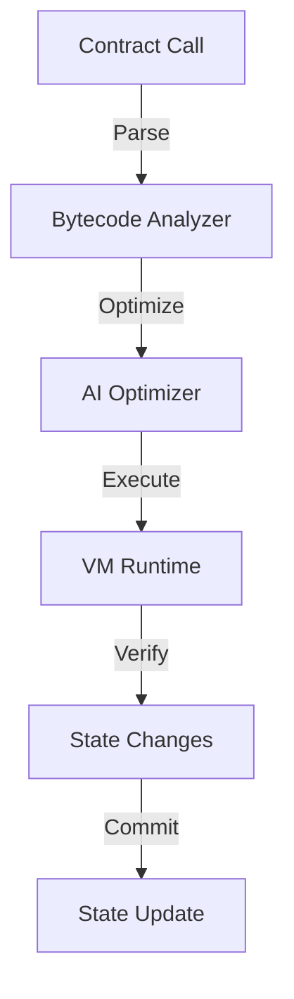

# EVM Processing Flow

## Overview
The Quids EVM extends the standard Ethereum Virtual Machine with AI optimization, quantum-resistant features, and enhanced security measures.

## Core Components

### 1. EVM Executor


**Implementation:**
```cpp
class EVMExecutor {
public:
    struct ExecutionConfig {
        uint64_t max_gas{15000000};
        bool enable_ai_optimization{true};
        bool use_quantum_verification{true};
        size_t max_call_depth{1024};
    };

    ExecutionResult executeContract(
        const Transaction& tx,
        const ExecutionContext& context
    ) {
        // 1. Setup execution environment
        auto env = prepareEnvironment(tx, context);
        
        // 2. AI optimization of bytecode
        auto optimized_code = ai_optimizer_->optimizeBytecode(
            env.contract.code
        );
        
        // 3. Execute optimized code
        auto result = interpreter_->execute(
            optimized_code,
            env
        );
        
        // 4. Verify state changes
        if (!verifyStateTransition(result.state_changes)) {
            return ExecutionResult::failure();
        }
        
        // 5. Generate quantum proof
        auto proof = quantum_prover_->generateStateProof(
            result.state_changes
        );
        
        return ExecutionResult{
            .success = true,
            .state_changes = result.state_changes,
            .gas_used = result.gas_used,
            .return_data = result.return_data,
            .quantum_proof = proof
        };
    }
};
```

### 2. AI Bytecode Optimizer
```cpp
class BytecodeOptimizer {
public:
    struct OptimizationResult {
        std::vector<uint8_t> optimized_code;
        std::vector<Optimization> applied_optimizations;
        double estimated_gas_saving;
    };

    OptimizationResult optimizeBytecode(const std::vector<uint8_t>& code) {
        // 1. Analyze bytecode patterns
        auto analysis = analyzeBytecode(code);
        
        // 2. Generate optimization candidates
        auto candidates = ml_model_->suggestOptimizations(analysis);
        
        // 3. Apply safe optimizations
        auto optimized = applyOptimizations(code, candidates);
        
        // 4. Verify correctness
        if (!verifyOptimizations(code, optimized.optimized_code)) {
            return {code, {}, 0.0}; // Return original if verification fails
        }
        
        return optimized;
    }

private:
    bool verifyOptimizations(
        const std::vector<uint8_t>& original,
        const std::vector<uint8_t>& optimized
    ) {
        return execution_simulator_->compareExecutions(
            original,
            optimized
        );
    }
};
```

### 3. State Management
```cpp
class EVMStateManager {
public:
    struct StateUpdate {
        std::unordered_map<Address, Account> account_updates;
        std::unordered_map<Address, Storage> storage_updates;
        std::vector<Log> logs;
    };

    bool applyStateChanges(const StateUpdate& updates) {
        try {
            // 1. Create state snapshot
            auto snapshot = createSnapshot();
            
            // 2. Apply updates
            for (const auto& [addr, account] : updates.account_updates) {
                if (!updateAccount(addr, account)) {
                    revertToSnapshot(snapshot);
                    return false;
                }
            }
            
            // 3. Update storage
            for (const auto& [addr, storage] : updates.storage_updates) {
                if (!updateStorage(addr, storage)) {
                    revertToSnapshot(snapshot);
                    return false;
                }
            }
            
            // 4. Emit logs
            for (const auto& log : updates.logs) {
                emit(log);
            }
            
            return true;
        } catch (const std::exception& e) {
            logger_->error("State update failed: {}", e.what());
            return false;
        }
    }
};
```

### 4. Quantum-Safe Extensions
```cpp
class QuantumSafeEVM {
public:
    struct QuantumExtension {
        // Quantum-resistant cryptographic operations
        std::vector<uint8_t> QCRYPTO_HASH = 0xf0;
        std::vector<uint8_t> QCRYPTO_VERIFY = 0xf1;
        std::vector<uint8_t> QCRYPTO_SIGN = 0xf2;
        
        // Quantum state operations
        std::vector<uint8_t> QSTATE_CREATE = 0xf3;
        std::vector<uint8_t> QSTATE_MEASURE = 0xf4;
        std::vector<uint8_t> QSTATE_ENTANGLE = 0xf5;
    };

    void registerQuantumOpcodes() {
        interpreter_->registerOpcode(
            QuantumExtension::QCRYPTO_HASH,
            [this](auto& frame) { return executeQHash(frame); }
        );
        
        interpreter_->registerOpcode(
            QuantumExtension::QCRYPTO_VERIFY,
            [this](auto& frame) { return executeQVerify(frame); }
        );
        
        // Register other quantum operations...
    }
};
```

## Metrics and Monitoring

```cpp
struct EVMMetrics {
    // Execution metrics
    uint64_t contracts_executed{0};
    uint64_t total_gas_used{0};
    std::chrono::microseconds avg_execution_time{0};
    
    // Optimization metrics
    double optimization_success_rate{0.0};
    double avg_gas_savings{0.0};
    size_t optimizations_applied{0};
    
    // State metrics
    size_t state_updates{0};
    size_t storage_updates{0};
    size_t reverts{0};
    
    // Quantum metrics
    size_t quantum_ops_executed{0};
    double quantum_verification_time{0.0};
    size_t quantum_proofs_generated{0};
    
    // Resource usage
    double memory_usage{0.0};
    double cpu_usage{0.0};
    size_t stack_depth{0};
};
```

This document details the EVM processing flow in the Quids blockchain, covering execution, optimization, state management, and quantum-safe extensions. 