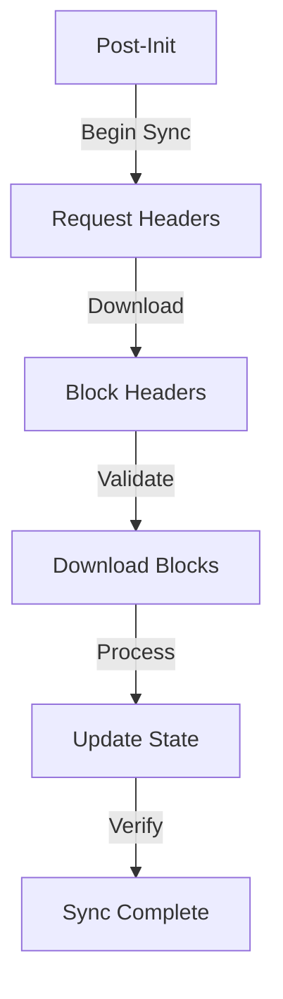

# Post-Initialization Flow

## Overview
After successful startup, the node enters its operational phase where it synchronizes with the network and begins normal operations.

## Detailed Flow

### 1. Network Synchronization


**Implementation:**
```cpp
class SyncManager {
public:
    void beginSync() {
        auto network_height = network_->getNetworkHeight();
        auto local_height = state_manager_->getCurrentHeight();
        
        if (network_height > local_height) {
            syncBlocks(local_height + 1, network_height);
        }
    }

private:
    void syncBlocks(uint64_t start_height, uint64_t end_height) {
        // Create download queue
        BlockDownloadQueue queue(start_height, end_height);
        
        // Start worker threads
        std::vector<std::thread> workers;
        for (size_t i = 0; i < config_.sync_threads; i++) {
            workers.emplace_back([this, &queue]() {
                processDownloadQueue(queue);
            });
        }
        
        // Wait for completion
        for (auto& worker : workers) {
            worker.join();
        }
    }
};
```

### 2. State Verification
```cpp
class StateVerifier {
public:
    bool verifyState() {
        // Verify state root
        if (!verifyStateRoot()) {
            return false;
        }
        
        // Verify account states
        if (!verifyAccounts()) {
            return false;
        }
        
        // Verify quantum state
        if (!verifyQuantumState()) {
            return false;
        }
        
        return true;
    }

private:
    bool verifyStateRoot() {
        auto computed_root = state_manager_->computeStateRoot();
        return computed_root == state_manager_->getCurrentStateRoot();
    }
};
```

### 3. Network Connection Management
```cpp
class NetworkManager {
public:
    void initializeConnections() {
        // Find initial peers
        auto peers = peer_discovery_->findPeers();
        
        // Connect to peers
        for (const auto& peer : peers) {
            if (connections_.size() < config_.max_peers) {
                connectToPeer(peer);
            }
        }
        
        // Start connection monitoring
        startConnectionMonitor();
    }

private:
    void startConnectionMonitor() {
        monitor_thread_ = std::thread([this]() {
            while (running_) {
                maintainConnections();
                std::this_thread::sleep_for(
                    std::chrono::seconds(30)
                );
            }
        });
    }
};
```

### 4. Service Activation
```cpp
class ServiceManager {
public:
    void activateServices() {
        // Start RPC service
        rpc_server_->start();
        
        // Start P2P service
        p2p_service_->start();
        
        // Start block processor
        block_processor_->start();
        
        // Start transaction pool
        tx_pool_->start();
        
        // Start AI optimization service
        ai_service_->start();
    }
};
```

## Event Processing System

### 1. Event Queue Setup
```cpp
class EventSystem {
public:
    void initialize() {
        registerHandlers();
        startEventLoop();
    }

private:
    void registerHandlers() {
        handlers_[EventType::BLOCK] = 
            [this](const Event& e) { handleBlock(e); };
        handlers_[EventType::TRANSACTION] = 
            [this](const Event& e) { handleTransaction(e); };
        handlers_[EventType::PEER_CONNECT] = 
            [this](const Event& e) { handlePeerConnect(e); };
        handlers_[EventType::PEER_DISCONNECT] = 
            [this](const Event& e) { handlePeerDisconnect(e); };
    }
    
    void startEventLoop() {
        event_thread_ = std::thread([this]() {
            while (running_) {
                processNextEvent();
            }
        });
    }
};
```

### 2. System State Monitoring
```cpp
class SystemMonitor {
public:
    void startMonitoring() {
        // Start metric collection
        metrics_collector_->start();
        
        // Start health monitoring
        health_monitor_->start();
        
        // Start performance monitoring
        performance_monitor_->start();
        
        // Start alert system
        alert_system_->start();
    }
    
    SystemHealth getCurrentHealth() {
        return SystemHealth{
            .cpu_usage = metrics_collector_->getCPUUsage(),
            .memory_usage = metrics_collector_->getMemoryUsage(),
            .network_latency = metrics_collector_->getNetworkLatency(),
            .peer_count = network_->getPeerCount(),
            .sync_status = sync_manager_->getSyncStatus(),
            .quantum_state = quantum_system_->getHealth(),
            .ai_system = ai_system_->getHealth()
        };
    }
};
```

## Error Recovery

### 1. Recovery Procedures
```cpp
class RecoveryManager {
public:
    void handleError(const SystemError& error) {
        switch (error.type) {
            case ErrorType::SYNC_FAILURE:
                handleSyncFailure(error);
                break;
            case ErrorType::STATE_MISMATCH:
                handleStateMismatch(error);
                break;
            case ErrorType::NETWORK_FAILURE:
                handleNetworkFailure(error);
                break;
            case ErrorType::QUANTUM_ERROR:
                handleQuantumError(error);
                break;
        }
    }

private:
    void handleSyncFailure(const SystemError& error) {
        // Log error
        logger_->error("Sync failure: {}", error.message);
        
        // Reset sync state
        sync_manager_->reset();
        
        // Retry synchronization
        sync_manager_->beginSync();
    }
};
```

## Metrics and Monitoring

```cpp
struct PostInitMetrics {
    // Sync metrics
    uint64_t blocks_processed{0};
    uint64_t sync_progress_percentage{0};
    std::chrono::milliseconds avg_block_processing_time{0};
    
    // Network metrics
    size_t connected_peers{0};
    double network_bandwidth_usage{0.0};
    
    // System metrics
    double cpu_usage{0.0};
    size_t memory_usage{0};
    
    // Service metrics
    bool rpc_service_active{false};
    bool p2p_service_active{false};
    bool processor_active{false};
    
    // AI system metrics
    double ai_model_accuracy{0.0};
    double optimization_effectiveness{0.0};
};
```

This document details the post-initialization flow of the Quids blockchain, covering synchronization, state verification, network management, and system monitoring. 