# Quids Blockchain Process Flow

## System Startup

### 1. Pre-Initialization Phase
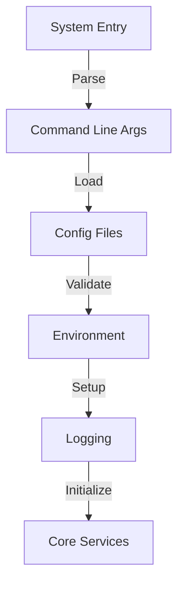

**Details:**
```cpp
// 1. Configuration Loading
void QuidsNode::loadConfiguration() {
    // Load config files
    config_.load("quids.conf");
    
    // Set up environment variables
    config_.setDataDir(getenv("QUIDS_DATA_DIR"));
    config_.setNetworkType(getenv("QUIDS_NETWORK"));
    
    // Initialize logging
    spdlog::set_pattern("[%Y-%m-%d %H:%M:%S.%e] [%^%l%$] [%t] %v");
    spdlog::set_level(config_.getLogLevel());
}
```

### 2. Core Component Initialization
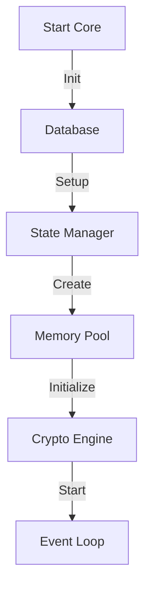

**Implementation:**
```cpp
// 2. Core Systems Setup
void QuidsNode::initializeCore() {
    // Database initialization
    storage_ = std::make_unique<PersistentStorage>(config_.getDataDir());
    
    // State management
    state_manager_ = std::make_unique<StateManager>();
    state_manager_->loadLatestState(storage_.get());
    
    // Memory pool setup
    memory_pool_ = std::make_unique<MemoryPool>(
        config_.getMaxMemory(),
        config_.getPoolSize()
    );
    
    // Cryptographic initialization
    crypto_engine_ = std::make_unique<QuantumCrypto>(
        QuantumEncryptionParams{
            .key_size = 256,
            .security_parameter = 128
        }
    );
}
```

### 3. Quantum System Initialization
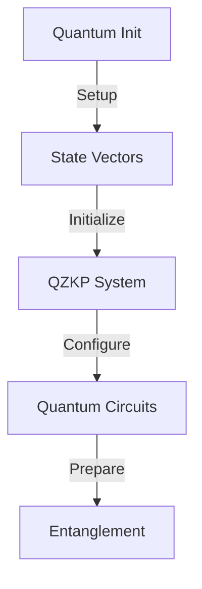

**Details:**
```cpp
// 3. Quantum System Setup
void QuidsNode::initializeQuantumSystem() {
    // Initialize quantum state manager
    quantum_state_ = std::make_unique<QuantumState>(
        config_.getNumQubits()
    );
    
    // Setup QZKP generator
    zkp_generator_ = std::make_unique<QZKPGenerator>();
    
    // Initialize quantum circuits
    quantum_circuit_ = std::make_unique<QuantumCircuit>(
        QuantumCircuitConfig{
            .num_qubits = config_.getNumQubits(),
            .use_error_correction = true,
            .optimization_level = 2
        }
    );
}
```

### 4. AI/ML System Initialization
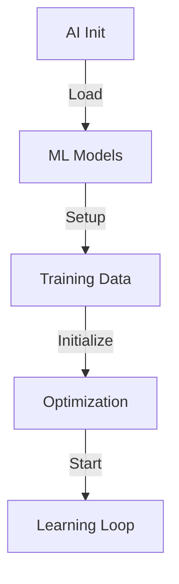

**Implementation:**
```cpp
// 4. AI/ML System Setup
void QuidsNode::initializeAISystem() {
    // Initialize ML model
    EnhancedMLParameters ml_params{
        .num_layers = 3,
        .hidden_size = 128,
        .learning_rate = 0.001,
        .dropout_rate = 0.2
    };
    
    ml_model_ = std::make_unique<EnhancedRollupMLModel>(ml_params);
    
    // Setup AI agent
    ai_agent_ = std::make_unique<AIRollupAgent>(
        zkp_generator_,
        ml_model_
    );
    
    // Initialize optimization loop
    optimization_thread_ = std::thread([this]() {
        while (!should_stop_) {
            ai_agent_->optimizeParameters();
            std::this_thread::sleep_for(
                std::chrono::seconds(config_.getOptimizationInterval())
            );
        }
    });
}
```

### 5. Network Service Initialization
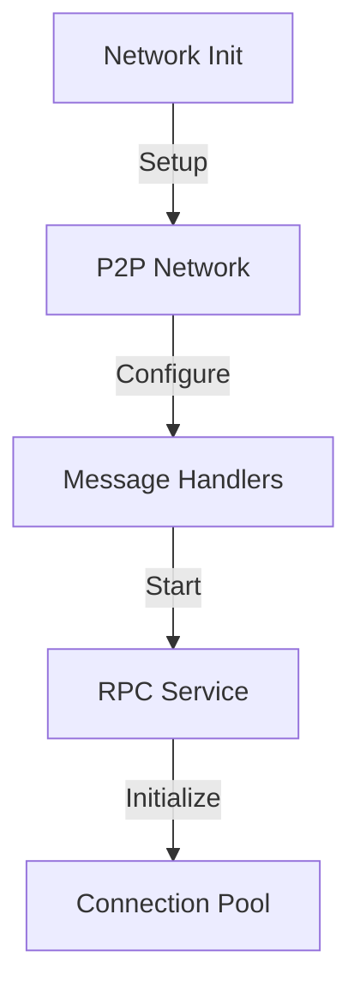

**Details:**
```cpp
// 5. Network Setup
void QuidsNode::initializeNetwork() {
    // Initialize P2P network
    network_ = std::make_unique<P2PNetwork>(
        config_.getListenPort(),
        config_.getMaxPeers()
    );
    
    // Setup message router
    router_ = std::make_unique<MessageRouter>();
    router_->registerHandler(
        MessageType::TRANSACTION,
        [this](const Message& msg) {
            return handleTransaction(msg);
        }
    );
    
    // Start RPC service
    rpc_server_ = std::make_unique<RPCServer>(
        config_.getRPCPort(),
        state_manager_,
        transaction_api_
    );
}
```

### 6. Final Startup Phase
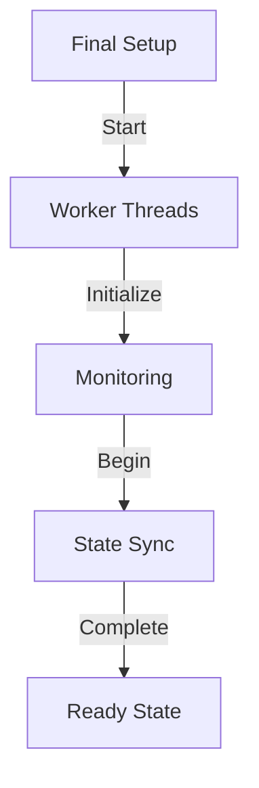

**Implementation:**
```cpp
// 6. Final Initialization
void QuidsNode::completeBoot() {
    // Start worker threads
    for (size_t i = 0; i < config_.getNumWorkers(); i++) {
        workers_.emplace_back(
            std::make_unique<WorkerThread>(
                transaction_pool_,
                state_manager_
            )
        );
    }
    
    // Initialize monitoring
    metrics_collector_ = std::make_unique<MetricsCollector>();
    metrics_collector_->startCollection();
    
    // Begin state synchronization
    state_manager_->synchronize(network_.get());
    
    // Mark system as ready
    system_state_ = SystemState::READY;
    spdlog::info("Quids node startup complete");
}
```

Each phase is carefully orchestrated to ensure proper initialization and dependency management. The system performs validation at each step and maintains proper error handling throughout the startup process.

## Post-Initialization Flow

### 1. Node Synchronization
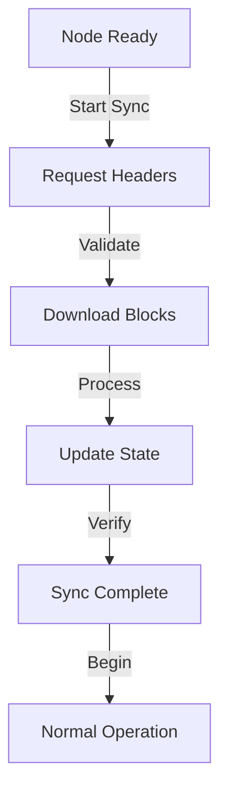

**Implementation:**
```cpp
void QuidsNode::beginSynchronization() {
    // Get current network state
    auto network_height = network_->getNetworkHeight();
    auto local_height = state_manager_->getCurrentHeight();
    
    if (network_height > local_height) {
        // Start sync process
        sync_manager_->synchronize(
            local_height + 1,
            network_height,
            [this](const Block& block) {
                return processIncomingBlock(block);
            }
        );
    }
}
```

### 2. Normal Operation Mode
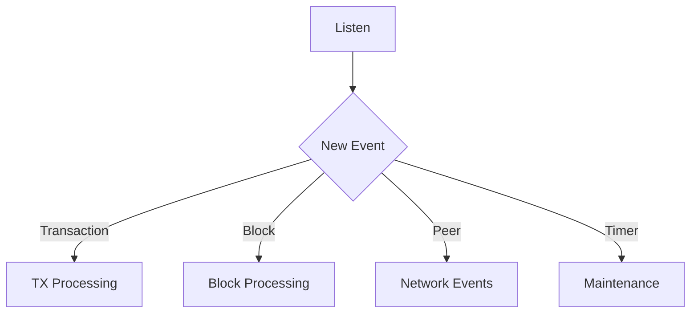

**Event Processing:**
```cpp
void QuidsNode::processEvents() {
    while (running_) {
        auto event = event_queue_->poll();
        switch (event.type) {
            case EventType::TRANSACTION:
                processTransaction(event.data);
                break;
            case EventType::BLOCK:
                processBlock(event.data);
                break;
            case EventType::PEER_CONNECTION:
                handlePeerEvent(event.data);
                break;
            case EventType::MAINTENANCE:
                performMaintenance();
                break;
        }
    }
}
```

### 3. Transaction Processing Pipeline
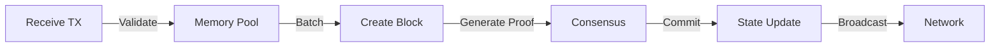

**Detailed Flow:**
```cpp
void QuidsNode::processTransaction(const Transaction& tx) {
    // 1. Initial validation
    if (!tx.isValid()) {
        return;
    }

    // 2. Add to memory pool
    if (memory_pool_->add(tx)) {
        // 3. Check if batch ready
        if (memory_pool_->shouldCreateBlock()) {
            createNewBlock();
        }
        
        // 4. Broadcast to network
        network_->broadcast(tx);
    }
}

void QuidsNode::createNewBlock() {
    // 1. Get transactions from pool
    auto transactions = memory_pool_->getBatch(config_.getMaxBlockSize());
    
    // 2. Generate quantum proof
    auto proof = quantum_circuit_->generateBlockProof(transactions);
    
    // 3. Create block
    Block block{
        .previous_hash = state_manager_->getLatestBlockHash(),
        .transactions = transactions,
        .proof = proof,
        .timestamp = getCurrentTimestamp()
    };
    
    // 4. Submit to consensus
    consensus_->submitBlock(block);
}
```

### 4. Block Processing
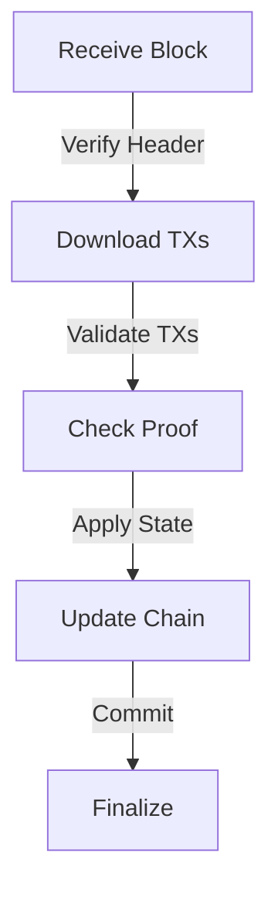

**Implementation:**
```cpp
void QuidsNode::processBlock(const Block& block) {
    // 1. Basic validation
    if (!block.isValid()) {
        return;
    }

    // 2. Verify quantum proof
    if (!quantum_circuit_->verifyBlockProof(block)) {
        return;
    }

    // 3. Apply state changes
    try {
        state_manager_->applyBlock(block);
        
        // 4. Update metrics
        metrics_collector_->recordBlockProcessed(block);
        
        // 5. Clean memory pool
        memory_pool_->removeTransactions(block.transactions);
        
        // 6. Broadcast if we're the creator
        if (block.creator == our_address_) {
            network_->broadcast(block);
        }
    } catch (const std::exception& e) {
        spdlog::error("Block processing failed: {}", e.what());
        // Initiate recovery if needed
        recovery_manager_->handleBlockError(block, e);
    }
}
```

### 5. Continuous Optimization
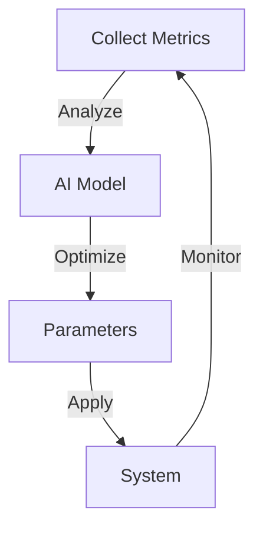

**AI Optimization Loop:**
```cpp
void QuidsNode::runOptimizationLoop() {
    while (running_) {
        // 1. Collect current metrics
        auto metrics = metrics_collector_->getMetrics();
        
        // 2. Feed to AI model
        auto suggestions = ai_agent_->analyzeMetrics(metrics);
        
        // 3. Apply optimizations
        for (const auto& [param, value] : suggestions) {
            system_parameters_->update(param, value);
        }
        
        // 4. Wait for next cycle
        std::this_thread::sleep_for(
            std::chrono::seconds(config_.getOptimizationInterval())
        );
    }
}
```

This flow represents the core operational loop of the Quids blockchain after initialization. Each component works in parallel, coordinated through the event system, while the AI system continuously optimizes performance based on real-time metrics.

## State Management

1. **State Transitions**
   ```cpp
   // Process flow for state updates
   StateManager::apply_transaction(tx) {
       1. Verify transaction validity
       2. Check account balances
       3. Apply state changes
       4. Generate state proof
       5. Update Merkle tree
   }
   ```

2. **Proof Generation**
   ```cpp
   // Quantum proof generation process
   RollupStateTransition::generate_proof() {
       1. Encode state to quantum format
       2. Apply quantum transformations
       3. Generate ZK proof
       4. Verify proof validity
       5. Return proof data
   }
   ```

## Cross-Chain Operations

1. **Chain Spawning**
   ```mermaid
   graph TD
       A[Monitor Load] -->|Threshold Exceeded| B[Spawn Decision]
       B -->|Create| C[New Chain]
       C -->|Initialize| D[State]
       D -->|Setup| E[Bridge]
   ```

2. **Cross-Chain Communication**
   - Message passing between chains
   - State synchronization
   - Bridge operations
   - Proof verification

## Performance Optimization

1. **AI-Driven Optimization**
   ```cpp
   // Continuous optimization loop
   AIRollupAgent::optimize() {
       1. Collect performance metrics
       2. Analyze bottlenecks
       3. Update ML model
       4. Adjust parameters
       5. Monitor results
   }
   ```

2. **Resource Management**
   - Dynamic scaling of resources
   - Load balancing between chains
   - Quantum resource allocation
   - Memory pool management

## Error Handling and Recovery

1. **Error Detection**
   ```mermaid
   graph LR
       A[Monitor] -->|Detect| B[Error]
       B -->|Analyze| C[Recovery Plan]
       C -->|Execute| D[Recovery Action]
       D -->|Verify| E[System State]
   ```

2. **Recovery Procedures**
   - State rollback capabilities
   - Proof regeneration
   - Chain reorganization
   - Emergency shutdown procedures

## System Shutdown

1. **Graceful Shutdown Process**
   ```cpp
   void shutdown() {
       1. Stop accepting new transactions
       2. Complete pending operations
       3. Flush state to disk
       4. Stop worker threads
       5. Close network connections
       6. Cleanup resources
   }
   ```

## Monitoring and Metrics

1. **Performance Metrics**
   - Transaction throughput
   - Proof generation time
   - State transition latency
   - Quantum resource usage
   - Network health

2. **System Health**
   ```mermaid
   graph TD
       A[Collect Metrics] -->|Process| B[Analysis]
       B -->|Alert| C[Issues]
       B -->|Update| D[Dashboard]
       B -->|Feed| E[ML Model]
   ```

## Security Measures

1. **Continuous Security Monitoring**
   - Quantum state verification
   - Proof validation
   - Network security
   - State integrity checks

2. **Attack Prevention**
   ```cpp
   // Security check flow
   SecurityManager::validate() {
       1. Verify quantum proofs
       2. Check transaction signatures
       3. Validate state transitions
       4. Monitor for anomalies
   }
   ```

## AI Component Operations

### 1. AIBlock Processing
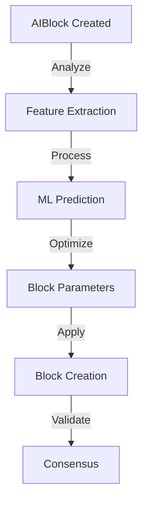

**Implementation:**
```cpp
class AIBlock {
    void processBlock() {
        // 1. Extract features from current state
        auto features = extractFeatures();
        
        // 2. Get ML predictions
        auto predictions = ml_model_->predict(features);
        
        // 3. Optimize block parameters
        BlockParameters params{
            .gas_limit = predictions.optimal_gas_limit,
            .tx_ordering = predictions.optimal_ordering,
            .quantum_params = predictions.quantum_settings
        };
        
        // 4. Apply optimizations
        applyOptimizations(params);
        
        // 5. Generate quantum-resistant proof
        generateQuantumProof();
    }
    
    AIMetrics calculateMetrics() {
        return AIMetrics{
            .quantum_security_score = calculateSecurityScore(),
            .transaction_efficiency = calculateEfficiency(),
            .network_health = getNetworkHealth(),
            .consensus_confidence = getConsensusConfidence()
        };
    }
};
```

### 2. AI Transaction Processing
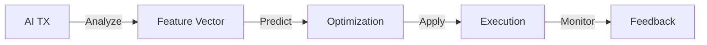

**AI Transaction Flow:**
```cpp
class AITransaction {
    void processAITransaction() {
        // 1. Extract transaction features
        TransactionFeatures features{
            .complexity = calculateComplexity(),
            .resource_requirements = estimateResources(),
            .security_requirements = assessSecurityNeeds()
        };
        
        // 2. Get ML-optimized parameters
        auto params = ml_model_->optimizeTransaction(features);
        
        // 3. Apply optimizations
        applyTransactionOptimizations(params);
        
        // 4. Monitor and collect feedback
        recordExecutionMetrics();
    }
};
```

### 3. AI Manager Operations
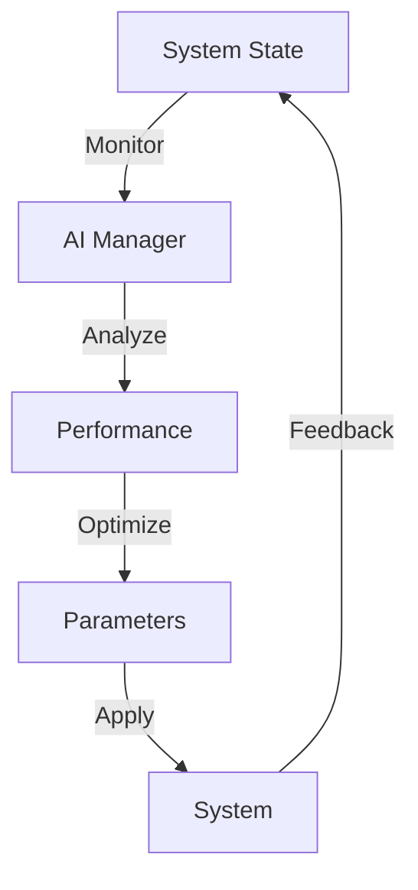

**AI Manager Implementation:**
```cpp
class AIManager {
    void manageSystem() {
        while (running_) {
            // 1. Collect system metrics
            auto metrics = collectSystemMetrics();
            
            // 2. Analyze performance
            auto analysis = analyzePerformance(metrics);
            
            // 3. Generate optimizations
            auto optimizations = generateOptimizations(analysis);
            
            // 4. Apply changes
            for (const auto& opt : optimizations) {
                applyOptimization(opt);
            }
            
            // 5. Record results
            recordOptimizationResults();
        }
    }
    
    OptimizationResult analyzePerformance(const SystemMetrics& metrics) {
        return OptimizationResult{
            .throughput_optimization = analyzeThroughput(),
            .latency_optimization = analyzeLatency(),
            .resource_optimization = analyzeResources(),
            .security_optimization = analyzeSecurityMetrics()
        };
    }
};
```

## EVM Processing

### 1. Contract Execution Flow
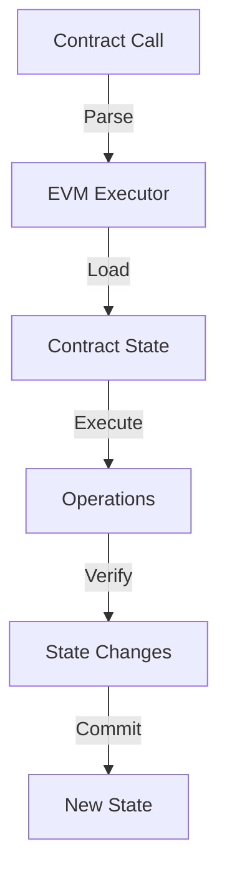

**EVM Implementation:**
```cpp
class EVMExecutor {
    ExecutionResult executeContract(const Transaction& tx) {
        // 1. Setup execution environment
        EVMEnvironment env{
            .contract = loadContract(tx.to),
            .caller = tx.from,
            .value = tx.value,
            .data = tx.data
        };
        
        // 2. Execute contract code
        try {
            auto result = interpreter_->execute(env);
            
            // 3. Verify state changes
            if (verifyStateTransition(result.state_changes)) {
                // 4. Commit changes
                state_manager_->commit(result.state_changes);
                return result;
            }
        } catch (const EVMException& e) {
            handleExecutionError(e);
        }
        
        return ExecutionResult::failure();
    }
};
```

### 2. Validator Process
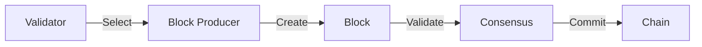

**Validator Implementation:**
```cpp
class Validator {
    void runValidation() {
        while (active_) {
            // 1. Check if selected as block producer
            if (isSelectedProducer()) {
                // 2. Create new block
                auto block = createBlock();
                
                // 3. Generate quantum-resistant proof
                auto proof = generateBlockProof(block);
                
                // 4. Submit to consensus
                if (consensus_->submitBlock(block, proof)) {
                    // 5. Broadcast to network
                    network_->broadcastBlock(block);
                }
            }
            
            // 6. Validate incoming blocks
            validatePendingBlocks();
        }
    }
    
    bool validateBlock(const Block& block) {
        return validateTransactions(block.transactions) &&
               validateQuantumProof(block.proof) &&
               validateStateTransition(block.state_changes);
    }
};
```

### 3. Smart Contract Optimization
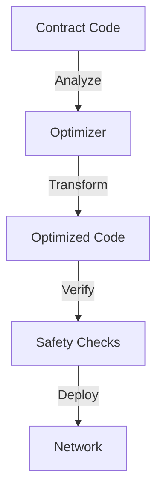

**Contract Optimization:**
```cpp
class ContractOptimizer {
    OptimizedContract optimize(const Contract& contract) {
        // 1. Analyze contract code
        auto analysis = analyzeContract(contract);
        
        // 2. Apply optimizations
        auto optimized = applyOptimizations(contract, analysis);
        
        // 3. Verify optimizations
        if (verifyOptimizations(optimized)) {
            // 4. Generate deployment code
            return generateDeploymentCode(optimized);
        }
        
        return contract; // Return original if optimization fails
    }
};
```

This document provides a high-level overview of the Quids blockchain process flow. For detailed implementation specifics, refer to the respective component documentation and source code. 