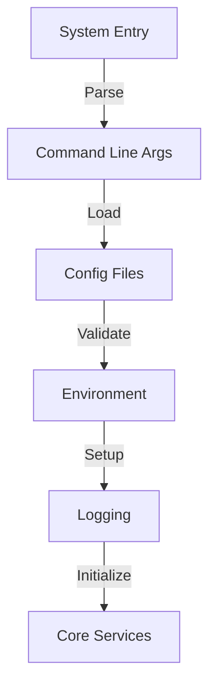

# Quids Blockchain Startup Flow

## Overview
The startup process is a critical phase that initializes all core components in the correct order, ensuring proper dependency management and system integrity.

## Detailed Flow

### 1. Pre-Initialization


**Configuration Structure:**
```cpp
struct QuidsConfig {
    // Network Configuration
    std::string network_type = "mainnet";
    uint16_t listen_port = 8545;
    uint16_t rpc_port = 8546;
    size_t max_peers = 50;
    
    // System Resources
    size_t max_memory_mb = 8192;
    size_t num_worker_threads = 4;
    
    // Quantum Parameters
    size_t num_qubits = 24;
    bool use_error_correction = true;
    
    // AI/ML Settings
    size_t ml_batch_size = 32;
    double learning_rate = 0.001;
    size_t hidden_size = 128;
    
    // Storage
    std::string data_dir;
    size_t cache_size_mb = 1024;
};
```

### 2. Core Component Initialization
- Database setup
- State management initialization
- Memory pool creation
- Cryptographic engine startup
- Event system initialization

### 3. Quantum System Initialization
- State vector preparation
- QZKP system setup
- Circuit initialization
- Entanglement preparation

### 4. AI/ML System Initialization
- Model loading
- Training data setup
- Optimization system initialization
- Learning loop startup

### 5. Network Service Initialization
- P2P network setup
- Message handler configuration
- RPC service startup
- Connection pool initialization

### 6. Final Startup Phase
- Worker thread creation
- Monitoring system initialization
- State synchronization
- System readiness verification

## Implementation Requirements

### Core Classes
```cpp
class QuidsNode {
public:
    QuidsNode(const QuidsConfig& config);
    ~QuidsNode();
    
    bool start();
    void stop();
    
private:
    // Initialization methods
    bool loadConfiguration();
    bool initializeCore();
    bool initializeQuantumSystem();
    bool initializeAISystem();
    bool initializeNetwork();
    bool completeBoot();
    
    // Core components
    std::unique_ptr<StateManager> state_manager_;
    std::unique_ptr<MemoryPool> memory_pool_;
    std::unique_ptr<QuantumCrypto> crypto_engine_;
    std::unique_ptr<EventSystem> event_system_;
    
    // System state
    std::atomic<bool> running_{false};
    SystemState state_{SystemState::INITIALIZING};
    QuidsConfig config_;
};
```

### Error Handling
```cpp
class StartupException : public std::runtime_error {
public:
    enum class Phase {
        PRE_INIT,
        CORE_INIT,
        QUANTUM_INIT,
        AI_INIT,
        NETWORK_INIT,
        FINAL_INIT
    };
    
    StartupException(Phase phase, const std::string& message);
    Phase getPhase() const;
    
private:
    Phase phase_;
};
```

## Startup Sequence

1. **System Entry**
   ```cpp
   int main(int argc, char** argv) {
       try {
           // Parse command line arguments
           auto config = parseCommandLine(argc, argv);
           
           // Create and start node
           QuidsNode node(config);
           if (!node.start()) {
               return 1;
           }
           
           // Wait for shutdown signal
           waitForShutdown();
           
           // Graceful shutdown
           node.stop();
           return 0;
       } catch (const StartupException& e) {
           std::cerr << "Startup failed during " 
                     << toString(e.getPhase()) 
                     << ": " << e.what() << std::endl;
           return 1;
       }
   }
   ```

2. **Configuration Validation**
   ```cpp
   bool QuidsNode::loadConfiguration() {
       // Validate paths
       if (!fs::exists(config_.data_dir)) {
           throw StartupException(
               Phase::PRE_INIT,
               "Data directory does not exist"
           );
       }
       
       // Validate network settings
       if (config_.listen_port == config_.rpc_port) {
           throw StartupException(
               Phase::PRE_INIT,
               "Listen port and RPC port must be different"
           );
       }
       
       // Initialize logging
       initializeLogging();
       
       return true;
   }
   ```

## Health Checks

Each initialization phase should include health checks:

```cpp
struct HealthCheck {
    bool core_services{false};
    bool quantum_system{false};
    bool ai_system{false};
    bool network{false};
    bool worker_threads{false};
    
    bool allHealthy() const {
        return core_services && 
               quantum_system && 
               ai_system && 
               network && 
               worker_threads;
    }
};

HealthCheck QuidsNode::performHealthCheck() {
    HealthCheck health;
    
    // Check core services
    health.core_services = 
        state_manager_->isHealthy() &&
        memory_pool_->isHealthy() &&
        crypto_engine_->isHealthy();
    
    // Check quantum system
    health.quantum_system =
        quantum_state_->isValid() &&
        zkp_generator_->isOperational();
    
    // Check AI system
    health.ai_system =
        ml_model_->isInitialized() &&
        ai_agent_->isRunning();
    
    // Check network
    health.network =
        network_->isConnected() &&
        rpc_server_->isListening();
    
    // Check worker threads
    health.worker_threads = 
        std::all_of(workers_.begin(), workers_.end(),
            [](const auto& worker) { return worker->isHealthy(); });
    
    return health;
}
```

## Monitoring and Metrics

During startup, the system should collect and report metrics:

```cpp
struct StartupMetrics {
    std::chrono::milliseconds total_startup_time{0};
    std::chrono::milliseconds core_init_time{0};
    std::chrono::milliseconds quantum_init_time{0};
    std::chrono::milliseconds ai_init_time{0};
    std::chrono::milliseconds network_init_time{0};
    size_t memory_usage{0};
    size_t thread_count{0};
};
```

This document provides a comprehensive guide for implementing the startup flow of the Quids blockchain. Each component is carefully initialized in the correct order with proper error handling and health checking. 