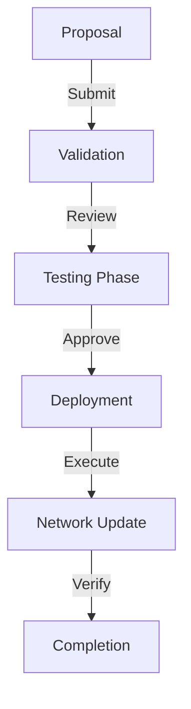

# Upgrade Process Flow

## Overview
The Quids blockchain implements a sophisticated upgrade system that allows for seamless updates to the protocol, smart contracts, and AI models while maintaining network stability and security.

## Upgrade Types

### 1. Protocol Upgrades


**Implementation:**
```cpp
class ProtocolUpgradeManager {
public:
    struct UpgradeProposal {
        uint32_t version;
        std::string description;
        std::vector<uint8_t> upgrade_code;
        std::vector<Test> test_suite;
        uint64_t activation_height;
    };

    bool proposeUpgrade(const UpgradeProposal& proposal) {
        // 1. Validate proposal
        if (!validateProposal(proposal)) {
            return false;
        }
        
        // 2. Run test suite
        auto test_results = testingEnvironment_->runTests(
            proposal.test_suite
        );
        
        // 3. If tests pass, schedule upgrade
        if (test_results.all_passed) {
            return scheduleUpgrade(proposal);
        }
        
        return false;
    }

private:
    bool scheduleUpgrade(const UpgradeProposal& proposal) {
        return upgrade_scheduler_->schedule(
            proposal.activation_height,
            proposal.upgrade_code
        );
    }
};
```

### 2. AI Model Updates
```cpp
class AIModelUpgrader {
public:
    struct ModelUpdate {
        std::string model_id;
        std::vector<uint8_t> new_weights;
        double performance_threshold;
        bool force_update;
    };

    bool updateModel(const ModelUpdate& update) {
        // 1. Validate new model
        auto validation = validateModel(update.new_weights);
        if (!validation.is_valid) {
            return false;
        }
        
        // 2. Test performance
        auto performance = testModelPerformance(
            update.new_weights
        );
        
        // 3. Apply update if performance meets threshold
        if (performance >= update.performance_threshold) {
            return applyModelUpdate(update);
        }
        
        return false;
    }
};
```

### 3. Smart Contract Updates
```cpp
class ContractUpgradeManager {
public:
    struct ContractUpgrade {
        Address contract_address;
        std::vector<uint8_t> new_code;
        std::vector<uint8_t> migration_code;
        bool is_proxy_upgrade;
    };

    bool upgradeContract(const ContractUpgrade& upgrade) {
        // 1. Verify upgrade permissions
        if (!verifyUpgradePermissions(upgrade)) {
            return false;
        }
        
        // 2. Create upgrade transaction
        auto tx = createUpgradeTransaction(upgrade);
        
        // 3. Execute upgrade
        if (upgrade.is_proxy_upgrade) {
            return executeProxyUpgrade(tx);
        } else {
            return executeDirectUpgrade(tx);
        }
    }
};
```

## Upgrade Safety Measures

### 1. Rollback System
```cpp
class UpgradeRollbackSystem {
public:
    void prepareRollback(const UpgradeContext& context) {
        // 1. Create state snapshot
        auto snapshot = state_manager_->createSnapshot();
        
        // 2. Store rollback data
        rollback_store_->save(context, snapshot);
        
        // 3. Set rollback point
        rollback_point_ = chain_->getCurrentHeight();
    }

    bool executeRollback() {
        // 1. Verify rollback conditions
        if (!shouldRollback()) {
            return false;
        }
        
        // 2. Load rollback data
        auto rollback_data = rollback_store_->load(
            rollback_point_
        );
        
        // 3. Execute rollback
        return state_manager_->rollback(rollback_data);
    }
};
```

### 2. Upgrade Verification
```cpp
class UpgradeVerifier {
public:
    struct VerificationResult {
        bool is_valid;
        std::vector<std::string> warnings;
        std::vector<std::string> errors;
    };

    VerificationResult verifyUpgrade(const Upgrade& upgrade) {
        // 1. Verify code integrity
        auto code_check = verifyCode(upgrade.code);
        
        // 2. Run security checks
        auto security_check = runSecurityChecks(upgrade);
        
        // 3. Verify compatibility
        auto compatibility = checkCompatibility(upgrade);
        
        return combineResults(
            code_check,
            security_check,
            compatibility
        );
    }
};
```

## Metrics and Monitoring

```cpp
struct UpgradeMetrics {
    // Upgrade statistics
    size_t total_upgrades{0};
    size_t successful_upgrades{0};
    size_t failed_upgrades{0};
    size_t rollbacks{0};
    
    // Performance impact
    double pre_upgrade_performance{0.0};
    double post_upgrade_performance{0.0};
    double upgrade_time{0.0};
    
    // Security metrics
    size_t security_warnings{0};
    size_t critical_issues{0};
    double security_score{0.0};
    
    // Network health
    double network_stability{0.0};
    size_t node_compatibility{0};
    double sync_rate{0.0};
};
```

This document details the upgrade process flow in the Quids blockchain, covering protocol upgrades, AI model updates, smart contract upgrades, and safety measures. 